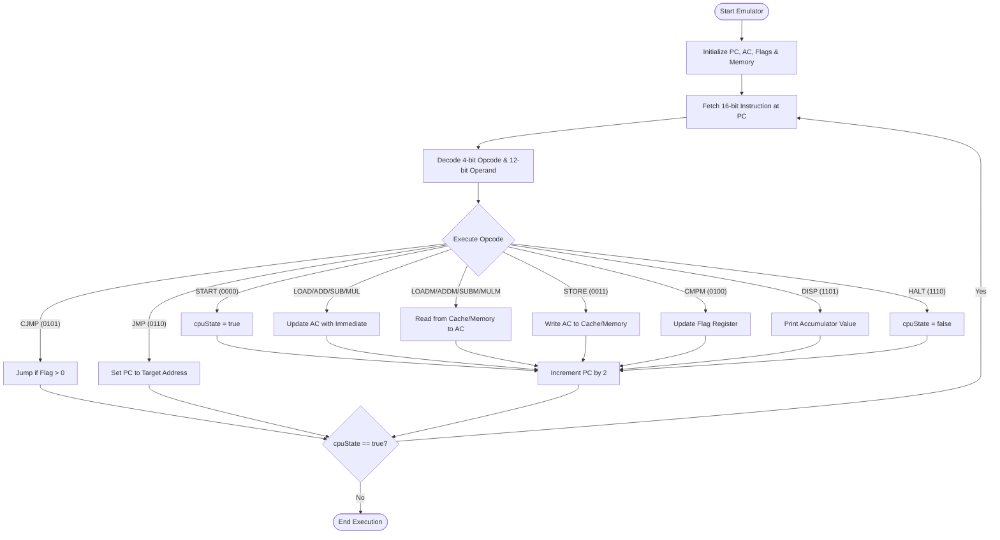
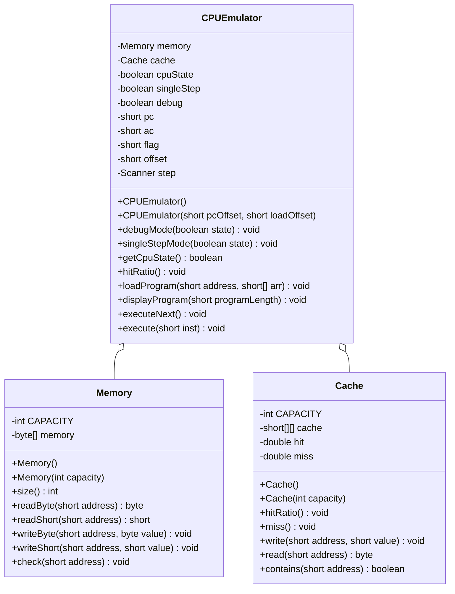

# CPU Emulator

A 16-bit CPU emulator abstraction implemented in Java, originally developed for the **CSE206 Computer Organization** course at **Akdeniz University**.

## Project Overview

This project simulates a simple computer system, including a CPU with a basic instruction set, main memory, and a direct-mapped cache. It is designed to demonstrate low-level computer architecture principles such as instruction decoding, memory management, and cache hit/miss logic.

## System Specifications

*   **Architecture**: 16-bit CPU abstraction.
*   **Memory**: 65,536 bytes (64 KB) of byte-addressable main memory.
*   **Cache**: Direct-mapped, 16 bytes total (8 blocks × 2 bytes).
*   **Byte Ordering**: Little-endian.
*   **Instruction Format**: 16-bit instructions consisting of a 4-bit opcode and a 12-bit operand.

## System Flowchart

The following diagram illustrates the instruction execution cycle of the emulator:



## Instruction Set Architecture (ISA)

The emulator supports the following 15 instructions:

| Opcode | Mnemonic | Description |
| :--- | :--- | :--- |
| `0000` | **START** | Begin execution |
| `0001` | **LOAD** | AC = Immediate value |
| `0010` | **LOADM** | AC = Memory[address] (cached) |
| `0011` | **STORE** | Memory[address] = AC (cached) |
| `0100` | **CMPM** | Compare AC with Memory[address]; set flag |
| `0101` | **CJMP** | Jump to address if comparison flag > 0 |
| `0110` | **JMP** | Unconditional jump to address |
| `0111` | **ADD** | AC += Immediate value |
| `1000` | **ADDM** | AC += Memory[address] (cached) |
| `1001` | **SUB** | AC -= Immediate value |
| `1010` | **SUBM** | AC -= Memory[address] (cached) |
| `1011` | **MUL** | AC *= Immediate value |
| `1100` | **MULM** | AC *= Memory[address] (cached) |
| `1101` | **DISP** | Print Accumulator (AC) value |
| `1110` | **HALT** | Stop execution |

## Code Structure (UML)

The internal architecture follows a modular design, separating memory management, caching logic, and the central processing unit:



## File Formats

### `program.txt`
Contains binary instructions as 16-bit strings, one per line.
Example:
```text
0000000000000000
0001000000010100
...
```

### `config.txt`
Always consists of exactly two lines:
1.  **Program Load Address**: Hexadecimal (e.g., `0x1000`).
2.  **Initial PC Value**: Hexadecimal absolute address (e.g., `0x1000`).

## Getting Started

### Prerequisites
*   Java Development Kit (JDK) 8 or higher.

### Compilation and Execution
You can use the provided `run.sh` script to compile and run the emulator with default settings:
```bash
cd cpu_emulator
chmod +x run.sh
./run.sh
```

Alternatively, compile and run manually:
```bash
# Compile
javac -d bin cpu_emulator/emulator/*.java

# Run
java -cp bin a120210808043 program.txt config.txt [debug] [singleStep]
```

### Command-line Arguments
*   `program.txt`: Path to the instruction file.
*   `config.txt`: Path to the configuration file.
*   `debug` (optional): `true/false` - Displays instructions on the terminal during execution.
*   `singleStep` (optional): `true/false` - Activates step-by-step mode (press any key to advance).

## Project Structure

*   `cpu_emulator/`: Root project directory.
    *   `emulator/`: Source code (`.java` files).
        *   `CPUEmulator.java`: Core CPU logic and instruction decoding.
        *   `Memory.java`: Main memory simulation.
        *   `Cache.java`: Cache controller and hit/miss logic.
        *   `a120210808043.java`: Entry point and file loader.
    *   `bin/`: Destination for compiled `.class` files.
    *   `program.txt`: Default sample program.
    *   `config.txt`: Default configuration.
    *   `Report.pdf`: Detailed project report.
    *   `CSE206-A1_CPU_Emulatorv2.pdf`: Original assignment instructions.
